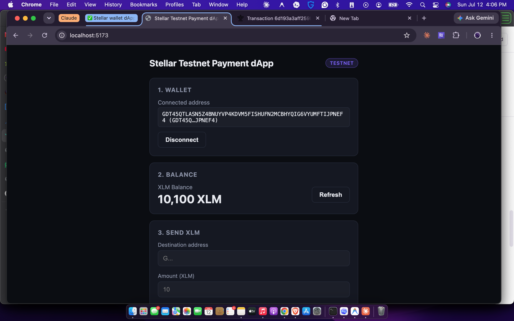
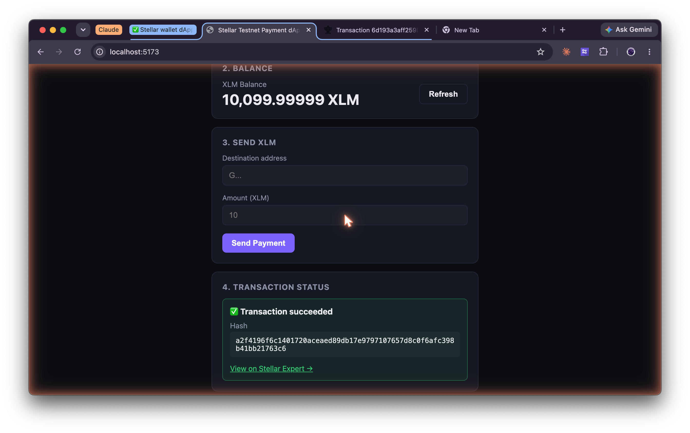

# Stellar Testnet Payment dApp

A minimal dApp for the Stellar Frontend Challenge (White Belt, Level 1). Connect a Freighter
wallet on **Stellar Testnet**, view your XLM balance, and send an XLM payment to any address —
with clear success/failure feedback and the transaction hash.

## Features

- **Wallet connect / disconnect** via the [Freighter](https://www.freighter.app/) browser extension
- **Balance fetch**: reads the connected account's native XLM balance from Horizon Testnet
- **Send XLM**: builds, signs (via Freighter), and submits a payment transaction on Testnet
- **Transaction feedback**: pending state, then a success card with the tx hash + a link to
  [Stellar Expert](https://stellar.expert/explorer/testnet), or an error card with the failure reason
- Handles common edge cases: extension not installed, wallet on the wrong network, unfunded
  account (with a Friendbot link), invalid destination address, rejected/failed transactions

## Tech stack

Plain HTML/CSS/JS — **no build step, no `npm install`**. The Stellar SDK and Freighter API are
loaded directly as ES modules from [esm.sh](https://esm.sh) in [`app.js`](app.js):

- [`@stellar/stellar-sdk`](https://github.com/stellar/js-stellar-sdk) — building/submitting transactions, Horizon queries
- [`@stellar/freighter-api`](https://github.com/stellar/freighter-api) — wallet connection and transaction signing

This keeps the project lightweight to run and easy to read end-to-end in a single `app.js` file.

## Setup instructions

### 1. Install and configure Freighter

1. Install the [Freighter wallet extension](https://www.freighter.app/) in your browser.
2. Create or import an account.
3. Open Freighter settings and switch the network to **Testnet**.
4. If the account has no balance yet, fund it using
   [Friendbot](https://friendbot.stellar.org) (the app will also show a Friendbot link
   automatically if it detects an unfunded account).

### 2. Run the app locally

No dependencies to install. Any static file server works. From the project folder:

```bash
python3 -m http.server 5173
```

Then open **http://localhost:5173** in your browser.

(Serving over `http://localhost` — not opening `index.html` directly via `file://` — is required
because browsers block ES module imports from the `file://` protocol.)

Alternatively, use the VS Code "Live Server" extension, or `npx serve .`.

### 3. Use it

1. Click **Connect Freighter** and approve the connection popup.
2. Your address and XLM balance appear. Use **Refresh** to re-check the balance any time.
3. Fill in a destination address and amount, then click **Send Payment**.
4. Approve the signing prompt in Freighter.
5. The Transaction Status card shows the result — a success card with the tx hash and an
   explorer link, or an error card explaining what went wrong.
6. Click **Disconnect** to reset the app's session state.

## Project structure

```
index.html    Markup for the wallet, balance, send, and status sections
style.css     Styling
app.js        All wallet/Stellar logic (connect, disconnect, balance, send, feedback)
```

## Screenshots

_Add screenshots to the `screenshots/` folder and reference them here before submitting:_

**Wallet connected**


**Balance displayed**


**Successful testnet transaction**

