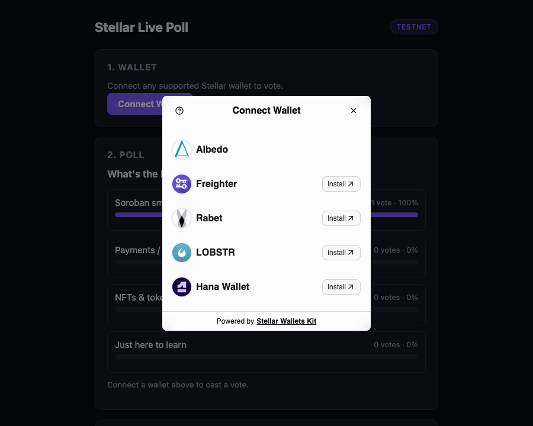
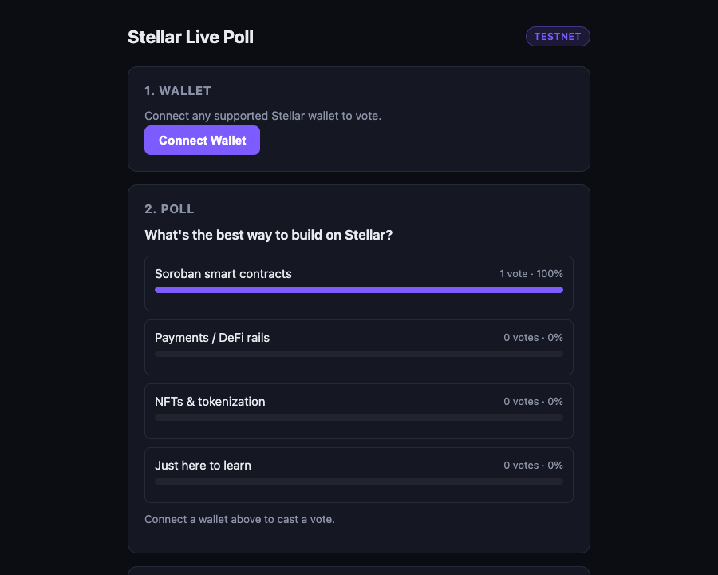
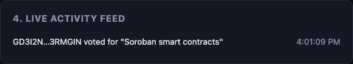

# Stellar Live Poll dApp

A multi-wallet dApp for the Stellar Frontend Challenge (Yellow Belt, Level 2). Connect any
supported Stellar wallet, vote in a one-question poll backed by a **Soroban smart contract
deployed on Testnet**, and watch results update live as other people vote — via real Soroban
contract events, not just polling a database.

## Features

- **Multi-wallet connect** via [Stellar Wallets Kit](https://stellarwalletskit.dev/) — Freighter,
  Albedo, Rabet, LOBSTR, and Hana Wallet all selectable from one modal (`StellarWalletsKit.authModal()`)
- **Deployed Soroban contract** (`level-2/contract/`) holding the poll's question, options, and
  vote counts on-chain
- **Contract calls from the frontend**: reads (`get_question`, `get_options`, `get_results`,
  `has_voted`) and a write (`vote`) via `@stellar/stellar-sdk`'s `contract.Client`
- **Live event sync**: polls Soroban RPC's `getEvents` for the contract's `vote` events and
  refreshes the results + an on-page Activity Feed the moment a new vote lands anywhere
- **Transaction status tracking**: pending → success (tx hash + Stellar Expert link) / error card,
  the same pattern as the Level 1 payment dApp
- **4 handled error cases** (see below), each with a distinct, human-readable message

## Tech stack

Plain HTML/CSS/JS — **no build step, no `npm install`** for the frontend. Everything is loaded as
ES modules from [esm.sh](https://esm.sh) in [`app.js`](app.js):

- [`@creit.tech/stellar-wallets-kit`](https://stellarwalletskit.dev/) — multi-wallet connect/sign
- [`@stellar/stellar-sdk`](https://github.com/stellar/js-stellar-sdk) (`contract.Client`, `rpc.Server`) — contract calls, reads, and event polling

The contract itself ([`contract/`](contract/)) is Rust + [`soroban-sdk`](https://crates.io/crates/soroban-sdk) `27.x`, compiled to the `wasm32v1-none` target and deployed with `stellar-cli`.

## Setup instructions

### 1. Install a Stellar wallet extension

Install any one of [Freighter](https://www.freighter.app/), [Albedo](https://albedo.link/),
[Rabet](https://rabet.io/), [LOBSTR](https://lobstr.co/), or [Hana Wallet](https://hanawallet.io/),
create/import an account, switch it to **Testnet**, and fund it via
[Friendbot](https://friendbot.stellar.org) if needed.

### 2. Run the frontend locally

No dependencies to install. From the `level-2/` folder:

```bash
python3 -m http.server 5174
```

Then open **http://localhost:5174**. (Serving over `http://localhost`, not `file://`, is required
for ES module imports to work.)

### 3. Use it

1. Click **Connect Wallet** and pick your wallet from the modal.
2. The poll question and live results load straight from the deployed contract.
3. Click **Vote for "..."** on an option, approve the signing prompt in your wallet.
4. The Transaction Status card shows pending → success (with tx hash + Stellar Expert link) or a
   friendly error.
5. The Live Activity Feed and vote counts update automatically — for you and for anyone else
   voting at the same time — via Soroban contract events, no page refresh needed.

## Smart contract

[`level-2/contract/src/lib.rs`](contract/src/lib.rs) — a single-question poll:

| Function | Type | Description |
|---|---|---|
| `initialize(admin, question, options)` | write | One-time setup, `admin.require_auth()`'d |
| `vote(voter, option_index)` | write | `voter.require_auth()`'d, one vote per address, publishes a `vote` event, returns the new count |
| `get_question()` / `get_options()` / `get_results()` | read | Poll state |
| `has_voted(voter)` | read | Whether an address has already voted |

Errors are a `#[contracterror]` enum (`AlreadyInitialized`, `NotInitialized`, `InvalidOption`,
`AlreadyVoted`) so the frontend can decode exactly what went wrong from the simulation failure.

Tested with `cargo test` (3 unit tests: successful vote + event emission, double-vote rejection,
invalid-option rejection) in [`contract/src/test.rs`](contract/src/test.rs).

### Deployed on Testnet

- **Contract ID**: [`CDDTAZUW6EHEPNZ7EMGYJAFYXOEA7NCPARB6QVST2Q7NPUMM6S54272R`](https://stellar.expert/explorer/testnet/contract/CDDTAZUW6EHEPNZ7EMGYJAFYXOEA7NCPARB6QVST2Q7NPUMM6S54272R)
- **Wasm hash**: `a225bf5625e60016fbcd784945f4b3ae8bf9332dda133ea6f57180a1dcd6b90d`
- **Poll question**: "What's the best way to build on Stellar?" (options: Soroban smart contracts,
  Payments / DeFi rails, NFTs & tokenization, Just here to learn)

**Transaction hashes** (verifiable on [Stellar Expert](https://stellar.expert/explorer/testnet)):

| Action | Tx hash |
|---|---|
| Upload contract wasm | [`18cad26ede6498d06b37eba44cc70721fee06a7c48ad3d796f709cf6726fc99f`](https://stellar.expert/explorer/testnet/tx/18cad26ede6498d06b37eba44cc70721fee06a7c48ad3d796f709cf6726fc99f) |
| Create contract instance | [`810260d3e2c5d66557bf04659aa29572b3792f98f3f098fbae42044d8782fceb`](https://stellar.expert/explorer/testnet/tx/810260d3e2c5d66557bf04659aa29572b3792f98f3f098fbae42044d8782fceb) |
| `initialize` call | [`3aaccb83d7922b34e0d174b3bc48b01bb1aa39dfabc219f7cccdf12311b947e4`](https://stellar.expert/explorer/testnet/tx/3aaccb83d7922b34e0d174b3bc48b01bb1aa39dfabc219f7cccdf12311b947e4) |
| `vote` call (contract function invoked through the same `Client.vote().signAndSend()` code path `app.js` uses) | [`27e8cab92eb4cc5d720002c29f9086768752bc9532a3f93089fdd6447d4b02a9`](https://stellar.expert/explorer/testnet/tx/27e8cab92eb4cc5d720002c29f9086768752bc9532a3f93089fdd6447d4b02a9) |

### How it was built and deployed

```bash
# Toolchain (one-time)
rustup target add wasm32v1-none
# stellar-cli 27.x from https://github.com/stellar/stellar-cli/releases

cd level-2/contract
cargo test                     # 3 unit tests
stellar contract build         # -> target/wasm32v1-none/release/poll.wasm

stellar keys generate deployer --network testnet --fund
stellar contract deploy \
  --wasm target/wasm32v1-none/release/poll.wasm \
  --source deployer --network testnet --alias poll
stellar contract invoke --id <CONTRACT_ID> --source deployer --network testnet -- \
  initialize --admin <DEPLOYER_ADDRESS> \
  --question "What's the best way to build on Stellar?" \
  --options '["Soroban smart contracts","Payments / DeFi rails","NFTs & tokenization","Just here to learn"]'
```

## Error handling

The frontend distinguishes and displays four real error cases, not synthetic ones:

1. **Wallet unavailable / connection failed** — the picked wallet module isn't installed or
   reachable; shown as a note under the Connect button with install guidance.
2. **User rejected** — the wallet-selection modal was closed, or the user declined the signing
   prompt (`AssembledTransaction.Errors.UserRejected`); shown as "no vote was cast."
3. **Insufficient balance / unfunded account** — the connected account has no XLM to cover the
   network fee; shown with a direct Friendbot funding link (mirrors the Level 1 pattern).
4. **Already voted** — decoded from the contract's `Error(Contract, #4)` simulation failure;
   shown as "this wallet address has already voted."

## Project structure

```
level-2/
  contract/
    src/lib.rs        Poll contract (initialize, vote, reads)
    src/test.rs        Unit tests
    Cargo.toml
  index.html            Wallet / poll / status / activity-feed markup
  style.css             Styling (same design system as Level 1)
  app.js                Wallet connect, contract reads/writes, event polling, error handling
  screenshots/          See below
```

## Screenshots

**Wallet options available** (multi-wallet modal via Stellar Wallets Kit)


**Live poll with results**


**Live activity feed after a vote**

