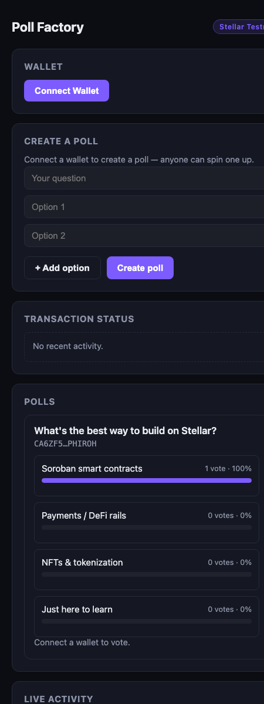
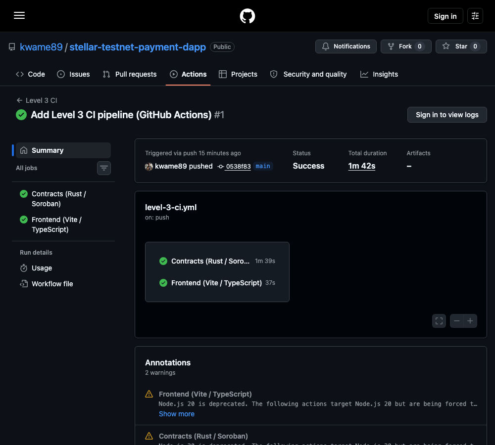
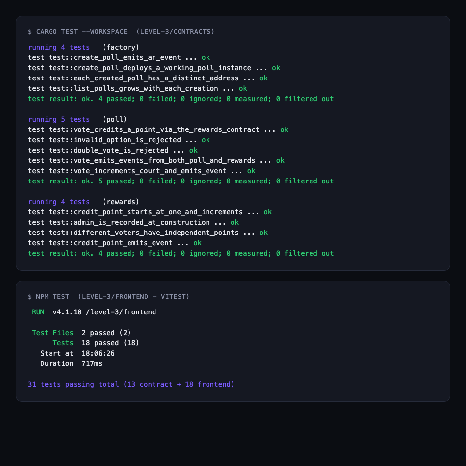

# Poll Factory + Rewards — Stellar Frontend Challenge (Orange Belt, Level 3)

A production-shaped Stellar dApp built around **inter-contract communication**: a Factory
contract that deploys new Poll contract instances on demand, and a Poll contract that calls a
separate Rewards contract on every vote. Anyone can spin up their own poll, vote on any poll with
any supported wallet, and watch results and reward points update live — via real Soroban contract
events, the same pattern [Level 2](../level-2/) established, extended across three contracts
instead of one.

**Live demo:** https://poll-factory-level3.vercel.app
**Contracts:** deployed on Stellar Testnet — see [Deployed on Testnet](#deployed-on-testnet) below,
full record in [`../DEPLOYMENT.md`](../DEPLOYMENT.md).

## Architecture

```
                    ┌─────────────┐
   creator ────────▶│   Factory   │──── deploy_v2(poll_wasm_hash) ───┐
                     └─────────────┘                                 │
                                                                      ▼
                                                              ┌───────────────┐
   voter ──────────────────────────────── vote() ───────────▶│  Poll instance │
                                                              └───────┬───────┘
                                                                      │ credit_point(voter)
                                                                      ▼
                                                              ┌───────────────┐
                                                              │    Rewards    │
                                                              └───────────────┘
```

Two distinct inter-contract mechanisms, not one repeated twice:

- **Factory → Poll (deployment):** `factory.create_poll()` deploys a brand-new Poll contract
  instance via `env.deployer().deploy_v2()`, passing the question/options/admin/rewards address
  as constructor arguments — deployment and initialization happen atomically in one call, and the
  new poll is registered in the factory's on-chain list.
- **Poll → Rewards (a live call):** every `poll.vote()` call also calls
  `rewards.credit_point(voter)` in the same transaction, via a client generated from Rewards'
  compiled wasm (`contractimport!`). Cross-contract calls in Soroban aren't isolated — if the
  Rewards call fails, the whole transaction (including the vote itself) reverts, so the vote and
  the point credit are atomic.

## Features

- **Multi-wallet connect** via [Stellar Wallets Kit](https://stellarwalletskit.dev/) — Freighter,
  Albedo, Rabet, LOBSTR, Hana — same proven pattern as Level 2, now via real npm imports instead
  of esm.sh
- **Create a poll** — any connected wallet can spin up a new poll (question + 2+ options); the
  Factory deploys and initializes it in one transaction
- **Vote on any poll** — live result bars, "you've voted" state, disabled once you've voted
- **Reward points** — every vote credits a point in the shared Rewards contract, shown next to
  your connected address
- **Live activity feed** — polls Soroban RPC's `getEvents` across the Factory and every known Poll
  address; new polls and votes (anywhere, by anyone) appear without a page refresh
- **Transaction status** throughout — pending → success (tx hash + Stellar Expert link) / error,
  with 7+ distinct decoded error cases (see [Error handling](#error-handling))
- **Mobile responsive** — verified at 375px, not just "doesn't break": stacked forms, full-width
  buttons, wrapped stat rows
- **CI/CD** — GitHub Actions runs contract tests + frontend tests/build on every push (see
  [`.github/workflows/level-3-ci.yml`](../.github/workflows/level-3-ci.yml))

## Tech stack

**Contracts:** Rust + [`soroban-sdk`](https://crates.io/crates/soroban-sdk) `27.x`, a 3-crate
Cargo workspace, compiled to `wasm32v1-none`, deployed with `stellar-cli`.

**Frontend:** Vite + TypeScript — unlike Level 1/2's no-build-step vanilla JS, this uses a real
build pipeline (needed for CI/CD and Vercel deployment, and for genuine unit tests via Vitest):

- [`@creit.tech/stellar-wallets-kit`](https://stellarwalletskit.dev/) — multi-wallet connect/sign
- [`@stellar/stellar-sdk`](https://github.com/stellar/js-stellar-sdk) (`contract.Client`,
  `rpc.Server`) — contract calls, reads, and event polling
- [Vitest](https://vitest.dev/) — 18 unit tests over the pure logic (error classification,
  formatting)

## Setup instructions

### 1. Contracts

```bash
rustup target add wasm32v1-none
# stellar-cli 27.x from https://github.com/stellar/stellar-cli/releases

cd contracts

# Build order matters — Poll's contractimport! reads Rewards' compiled wasm at
# compile time, and Factory's tests read Poll's, so each needs to exist first.
cargo build -p rewards --target wasm32v1-none --release
cargo build -p poll --target wasm32v1-none --release
cargo build -p factory --target wasm32v1-none --release

cargo test --workspace   # 13 tests
```

### 2. Frontend

```bash
cd frontend
npm install
cp .env.example .env.local   # fill in your own deployed contract IDs, or use the ones below
npm test                     # 18 tests
npm run dev                  # http://localhost:5175
```

### 3. Deploy the contracts yourself (optional — testnet instances already live)

```bash
stellar keys generate deployer --network testnet --fund
DEPLOYER=$(stellar keys address deployer)

# Rewards — deployed standalone
stellar contract deploy --wasm contracts/target/wasm32v1-none/release/rewards.wasm \
  --source deployer --network testnet -- --admin $DEPLOYER

# Poll — only uploaded, never deployed standalone; the Factory deploys instances from this hash
stellar contract upload --wasm contracts/target/wasm32v1-none/release/poll.wasm \
  --source deployer --network testnet
# → POLL_WASM_HASH

# Factory — deployed with the poll wasm hash and an admin
stellar contract deploy --wasm contracts/target/wasm32v1-none/release/factory.wasm \
  --source deployer --network testnet -- --admin $DEPLOYER --poll_wasm_hash $POLL_WASM_HASH
```

## Smart contracts

### Factory ([`contracts/factory/src/lib.rs`](contracts/factory/src/lib.rs))

| Function | Type | Description |
|---|---|---|
| `__constructor(admin, poll_wasm_hash)` | write | One-time setup — records the admin and the Poll wasm hash new instances deploy from |
| `create_poll(creator, question, options, rewards_contract)` | write | `creator.require_auth()`'d. Deploys+initializes a new Poll instance via `deploy_v2`, registers it, publishes a `PollCreated` event, returns the new poll's address |
| `list_polls()` | read | Every poll address created by this factory |
| `get_admin()` / `get_poll_wasm_hash()` | read | Factory config |

### Poll ([`contracts/poll/src/lib.rs`](contracts/poll/src/lib.rs))

| Function | Type | Description |
|---|---|---|
| `__constructor(admin, question, options, rewards_contract)` | write | Called atomically by the Factory's `deploy_v2` — no separate init step |
| `vote(voter, option_index)` | write | `voter.require_auth()`'d, one vote per address. Increments the count, calls `rewards.credit_point(voter)`, publishes a `VoteCast` event, returns the new count |
| `get_question()` / `get_options()` / `get_results()` / `has_voted()` / `get_admin()` / `get_rewards_contract()` | read | Poll state |

Errors: `InvalidOption`, `AlreadyVoted` (`#[contracterror]`, decoded by the frontend from the
simulation failure).

### Rewards ([`contracts/rewards/src/lib.rs`](contracts/rewards/src/lib.rs))

| Function | Type | Description |
|---|---|---|
| `__constructor(admin)` | write | Records an admin (not currently used to gate `credit_point` — see the doc comment in the source for why) |
| `credit_point(voter)` | write | Increments `voter`'s point total, publishes a `PointCredited` event, returns the new total. Called by Poll on every vote |
| `get_points(voter)` | read | A voter's total points across every poll |
| `get_admin()` | read | Rewards config |

**Tested with `cargo test --workspace`** (13 unit tests across all three contracts — including a
full deploy-and-vote integration test in `factory/src/test.rs` that deploys a real Poll instance
and confirms its vote actually reaches a real Rewards instance):

```
running 4 tests   (factory)
test test::create_poll_emits_an_event ... ok
test test::create_poll_deploys_a_working_poll_instance ... ok
test test::each_created_poll_has_a_distinct_address ... ok
test test::list_polls_grows_with_each_creation ... ok

running 5 tests   (poll)
test test::vote_credits_a_point_via_the_rewards_contract ... ok
test test::invalid_option_is_rejected ... ok
test test::double_vote_is_rejected ... ok
test test::vote_emits_events_from_both_poll_and_rewards ... ok
test test::vote_increments_count_and_emits_event ... ok

running 4 tests   (rewards)
test test::credit_point_starts_at_one_and_increments ... ok
test test::admin_is_recorded_at_construction ... ok
test test::different_voters_have_independent_points ... ok
test test::credit_point_emits_event ... ok

test result: ok. 13 passed; 0 failed
```

## Deployed on Testnet

| Contract | Address |
|---|---|
| Rewards | [`CCA66JVPGXTGSY7DKB5FR6TKD2XO3UE4K5FNOBTDNXQUU55IZET6QUKY`](https://stellar.expert/explorer/testnet/contract/CCA66JVPGXTGSY7DKB5FR6TKD2XO3UE4K5FNOBTDNXQUU55IZET6QUKY) |
| Factory | [`CB3J4TMTKHORFXGLMSAFYZRZXD6PTSJSX4QCR3H7CDYC2ZMHQZIFHORU`](https://stellar.expert/explorer/testnet/contract/CB3J4TMTKHORFXGLMSAFYZRZXD6PTSJSX4QCR3H7CDYC2ZMHQZIFHORU) |
| First live poll (created via the Factory) | [`CA6ZF5MBEC7XJ6AEDPWBAYLXKZNGF6VWJBESGPMVJ6WPNV2M4FPHIROH`](https://stellar.expert/explorer/testnet/contract/CA6ZF5MBEC7XJ6AEDPWBAYLXKZNGF6VWJBESGPMVJ6WPNV2M4FPHIROH) |

**Key transaction hashes** (full list with every upload/deploy tx in
[`../DEPLOYMENT.md`](../DEPLOYMENT.md)):

| Action | Tx hash |
|---|---|
| `create_poll` — Factory deploys a live Poll instance | [`d09e9668c3d48578ff934c5aa1ee616072ef439deaa4d6531b63d93bb17e0153`](https://stellar.expert/explorer/testnet/tx/d09e9668c3d48578ff934c5aa1ee616072ef439deaa4d6531b63d93bb17e0153) |
| `vote` — Poll calls Rewards.credit_point; emits **both** `point_credited` and `vote_cast` events in one transaction | [`8899ea356bb6660496bce0da315d643d77265a9c051e2a3b07e2986e0eec0a3b`](https://stellar.expert/explorer/testnet/tx/8899ea356bb6660496bce0da315d643d77265a9c051e2a3b07e2986e0eec0a3b) |

## CI/CD

[`.github/workflows/level-3-ci.yml`](../.github/workflows/level-3-ci.yml) runs on every push/PR
touching `level-3/`:

- **Contracts job** — builds each contract's wasm in the exact order their `contractimport!`
  macros require (Rewards → Poll → Factory — these aren't Cargo package dependencies, so
  `cargo test --workspace` alone can't infer the order), then runs all 13 tests.
- **Frontend job** — `npm test` (18 Vitest tests), then a full type-check + production build.

Both jobs are green on the current `main` — see the
[Actions tab](https://github.com/kwame89/stellar-testnet-payment-dapp/actions/workflows/level-3-ci.yml).

## Error handling

The frontend distinguishes and displays real error cases via `classifyContractError` (unit-tested
in [`frontend/tests/errors.test.ts`](frontend/tests/errors.test.ts)):

1. **Wallet unavailable / rejected** — the picked wallet isn't installed, or the user declined the
   signing prompt
2. **Already voted** — decoded from `Error(Contract, #2)`
3. **Invalid option** — decoded from `Error(Contract, #1)` (shouldn't be reachable from the UI,
   handled defensively anyway)
4. **Unfunded account** — shown with a direct Friendbot funding link
5. **Insufficient balance** — not enough XLM to cover the network fee
6. **Unmapped contract errors** — falls back to the raw simulation message rather than a generic
   "something went wrong"
7. **Poll-load failure** — an individual poll card fails independently without breaking the rest
   of the list

Every write action (create poll, vote) shows pending → success (with a Stellar Expert link) or a
specific error — never a silent failure.

## Project structure

```
level-3/
  contracts/
    Cargo.toml            Workspace root
    rewards/src/lib.rs      credit_point, get_points
    poll/src/lib.rs         __constructor, vote (calls Rewards), reads
    factory/src/lib.rs      create_poll (deploys Poll instances), list_polls
    */src/test.rs           13 unit tests total
  frontend/
    src/
      config.ts            Env-based contract IDs, network constants
      wallet.ts            Stellar Wallets Kit setup, connect/disconnect/sign
      contracts.ts         Generic contract.Client wrappers, typed by hand
      events.ts             Live event polling (Soroban RPC getEvents)
      errors.ts / format.ts Pure, unit-tested helpers
      main.ts               App wiring — wallet, create-poll, poll list, activity feed
      style.css             Design system + mobile-responsive rules
    tests/                 18 Vitest tests
  screenshots/             See below
```

## Screenshots

**Mobile-responsive UI** (live production site)


**CI pipeline — both jobs green**


**Test output — 31 passing (13 contract + 18 frontend)**


## Demo video

_Link to be added — a 1–2 minute walkthrough covering: connecting a wallet, creating a poll
(Factory deploying a new Poll instance live), voting (Poll calling Rewards in the same
transaction), and the live activity feed picking up both._
